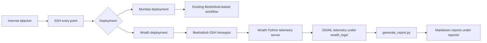
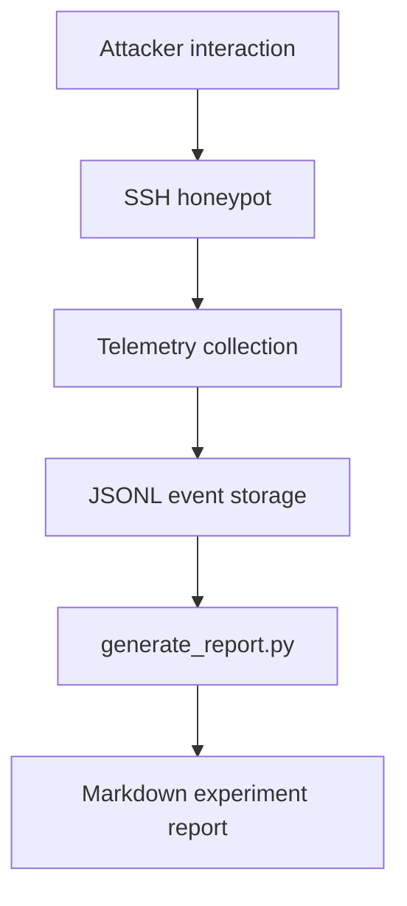

# Ghost Cloud: LLM Honeypots in AWS

## Project Overview

Ghost Cloud is a research repository for collecting attacker behavior from multiple AWS honeypot deployments. The Mumbai deployment is the LLM adaptation path, using a local Ollama backend with `qwen2.5:0.5b` to generate interactive shell responses on a `t3.micro` (Ubuntu 24.04, Beelzebub on port 2222). The Wraith deployment in `us-east-1`/Virginia is the deterministic static-shell path. Both remain documented because they serve different research goals and are intentionally preserved side by side.

The shared objective is to observe how attackers interact with realistic SSH honeypots, compare behavior across deployments, and store evidence in a form that is easy to analyze later.

## Research Objectives

- Capture reconnaissance, privilege escalation, persistence, and malware download attempts
- Record attacker IPs, SSH client fingerprints, command execution, and response behavior
- Evaluate limitations of conventional or purely LLM-driven honeypot behavior on constrained cloud instances
- Develop a more realistic adaptive SSH shell (deterministic semantics with optional controlled LLM assistance)
- Preserve a deterministic, low-maintenance telemetry pipeline for repeatable analysis
- Compare static/traditional behavior versus richer interactive Wraith behavior (observational comparison documented in `docs/deployment-comparison.md` after recovery of both deployments; caveat: different regions/periods, not a controlled causal experiment)

## System Architecture



## Deployment Overview

### Mumbai Deployment

The Mumbai deployment is the LLM-adapted honeypot environment and remains valid. It ran in `ap-south-1` (Mumbai) on `wraith-honeypot` (`t3.micro`, Beelzebub on `2222`, Ollama `qwen2.5:0.5b`) and is the adaptive baseline for interactive shell behavior. Recovered dataset: `2026-07-03T18:59:13Z` - `2026-07-26T17:23:56Z`, 773 unique observed source IPs, 942 sessions, 15,153 login attempts, but only 1 session progressed to command execution: indicating heavy automated credential-guessing with minimal engagement depth. Local LLM inference was observed to be operationally fragile on `t3.micro` (OOM/resource exhaustion and degraded networking ended telemetry on July 26). See `experiments/mumbai/` for the full 24-report recovered set and research notes.

See:
- [experiments/mumbai/README.md](experiments/mumbai/README.md)
- [experiments/mumbai/cumulative.md](experiments/mumbai/cumulative.md)
- [docs/aws-deployment-notes.md](docs/aws-deployment-notes.md)
- [docs/architecture-notes.md](docs/architecture-notes.md)

### Wraith Deployment

The Wraith deployment is the deterministic shell path. Code for the adaptive shell is implemented locally in `wraith/` and is exercised via `demo_fake_shell.py` and unit tests. The cloud instance `wraith-us-east-static` in `us-east-1` (public IP historically `100.27.226.37`, honeypot port `2222`) was recovered after an admin SSH outage (masked `ssh.socket`, see `docs/us-east-recovery.md`) via offline EBS repair with snapshot. It produced real-world telemetry: 12 unique attacker IPs, 12 sessions, 11 with commands, 21103 commands from `2026-07-12` to `2026-09-06` (`reports/us-east/`; test traffic excluded via `scripts/generate_report_us_east.py`). See `docs/us-east-results.md` and `reports/us-east/cumulative.md`.

Wraith highlights (local implementation verified, cloud telemetry recovered):

- Deterministic fake Linux shell (session identity, parser, filesystem, persona, privesc simulation, registry, telemetry) - `wraith/server.py:88` handles 30+ commands
- Python telemetry server for structured session logging (`wraith/server.py`, JSONL under `wraith_logs/`)
- JSONL storage for session and command events (`wraith/telemetry.py` `events.jsonl`)
- Markdown report generation with `scripts/generate_report_us_east.py` (Wraith JSONL) and `scripts/generate_report.py` (Mumbai Beelzebub logs)
- Systemd persistence definitions in `deploy/` (`beelzebub-simulator.service`); Beelzebub and Wraith services verified active after recovery

## Telemetry Pipeline



Wraith telemetry currently captures:

- `session_started`
- `command_executed`
- `session_ended`

Collected fields include attacker IP, client string, command, response, cwd, latency_ms, and timestamps.

## Experiment Workflow

1. Deploy the selected honeypot environment on AWS.
2. Allow attacker traffic to interact with the SSH service.
3. Collect structured JSONL telemetry.
4. Exclude test traffic when needed.
5. Generate daily or cumulative Markdown reports.
6. Review the reports and append manual notes in the experiment log.

## Repository Structure

- [README.md](README.md) - project overview and deployment summary
- [docs/](docs) - architecture, telemetry, deployment, and background notes; key results: `docs/us-east-results.md`, `docs/mumbai-results.md`, `docs/deployment-comparison.md`, `docs/us-east-recovery.md`, `docs/mumbai-incident.md`
- [experiments/](experiments) - Mumbai daily and cumulative experiment reports (`experiments/mumbai/` 24+1 reports)
- [reports/](reports) - Wraith experiment reports (`reports/us-east/` 14 daily + `cumulative.md`)
- [wraith_logs/](wraith_logs) - raw JSONL telemetry output from the Wraith deployment (gitignored, backup `raw-data-us-east/`)
- [deploy/](deploy) - deployment documentation and service definitions
- [infra/](infra) - AWS environment notes and operational guidance
- [scripts/](scripts) - report generation utilities (`generate_report.py`, `generate_report_us_east.py`)
- [wraith/](wraith) - simulator runtime used by the Wraith deployment

## Setup Instructions

For local simulator development and verification:

```bash
python -m venv .venv
source .venv/bin/activate  # Windows: .venv\Scripts\activate
pip install -r requirements.txt
python demo_fake_shell.py
```

For the deployed Wraith stack, enable the systemd services on the Ubuntu EC2 instance and keep the simulator and honeypot running independently from the terminal.

## Current Status

**Completed**

- Mumbai AWS deployment on `wraith-honeypot` (`t3.micro`, `ap-south-1`, Ubuntu 24.04, Beelzebub on `2222`, local Ollama `qwen2.5:0.5b`) - 24 dated reports + `cumulative.md` in `experiments/mumbai/` (period `2026-07-03T18:59:13Z` - `2026-07-26T17:23:56Z`, 773 IPs, 942 sessions, 15153 logins, 1 command from `47.113.113.162`)
- Recovery of surviving Mumbai telemetry and regeneration via `scripts/generate_report.py` (test traffic excluded); investigation of July 26 OOM resource exhaustion and degraded guest networking with `2026-09-10` reboot recovery (`docs/mumbai-incident.md`)
- Development of Wraith deterministic shell components (`wraith/` - filesystem, parser, session identity, persona, privesc, registry, telemetry, server) with local demo `demo_fake_shell.py` and tests `tests/test_fake_shell.py`
- US-East AWS deployment `wraith-us-east-static` (`us-east-1`, `100.27.226.37:2222`) - 14 daily reports + `cumulative.md` in `reports/us-east/` (period `2026-07-12` - `2026-09-06`, 12 IPs, 12 sessions, 11 with commands, 21103 commands, see `docs/us-east-results.md`)
- US-East recovery from masked `ssh.socket -> /dev/null` via offline EBS repair with snapshot, telemetry preserved and verified (`docs/us-east-recovery.md`)
- Observational comparison between Mumbai (LLM-assisted) and US-East (deterministic Wraith) documented in `docs/deployment-comparison.md` (caveat: different regions/periods, not a controlled causal experiment)
- Analysis docs: `docs/mumbai-results.md`, `docs/us-east-results.md`, `docs/mumbai-incident.md`, `docs/deployment-comparison.md`

**Pending / future**

- Session persistence evaluation beyond per-session in-memory state (no Redis persistence implemented - `wraith/filesystem.py` is per-session)
- Final consolidated research analysis after extended observation if additional deployments are run
- Optional controlled LLM fallback as adaptive layer (planned, not production-complete in `wraith/server.py`)

## Future Work

- Extend observation periods with additional deployments if resources permit
- Add normalized engagement metrics (unique commands, de-duplicated sessions) to `scripts/generate_report_us_east.py` and `scripts/generate_report.py`
- Preserve the current deterministic simulator while extending the telemetry analysis layer with optional LLM assistance
- Validate service boot configuration (`systemctl is-enabled ssh.service`, no `ssh.socket` mask) after any future deployment
