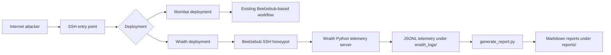
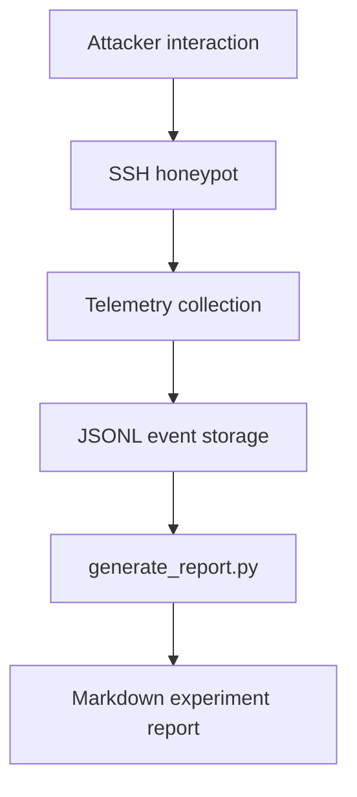

# Ghost Cloud: LLM Honeypots in AWS

## Project Overview

Ghost Cloud is a research repository for collecting attacker behavior from multiple AWS honeypot deployments. The Mumbai deployment is the LLM adaptation path, using a local Ollama backend with `qwen2.5:0.5b` to generate interactive shell responses on a `t3.micro` (Ubuntu 24.04, Beelzebub on port 2222). The Wraith deployment in `us-east-1`/Virginia is the deterministic static-shell path. Both remain documented because they serve different research goals and are intentionally preserved side by side.

The shared objective is to observe how attackers interact with realistic SSH honeypots, compare behavior across deployments, and store evidence in a form that is easy to analyze later.

## Research Objectives

- Capture reconnaissance, privilege escalation, persistence, and malware download attempts
- Record attacker IPs, SSH client fingerprints, command execution, and response behavior
- Compare how attackers behave across the Mumbai LLM-backed deployment and the Wraith static-shell deployment
- Preserve a deterministic, low-maintenance telemetry pipeline for repeatable analysis

## System Architecture



## Deployment Overview

### Mumbai Deployment

The Mumbai deployment is the LLM-adapted honeypot environment and remains valid. It ran in `ap-south-1` (Mumbai) on `wraith-honeypot` (`t3.micro`, Beelzebub on `2222`, Ollama `qwen2.5:0.5b`) and is the adaptive baseline for interactive shell behavior. Recovered dataset: `2026-07-03T18:59:13Z` - `2026-07-26T17:23:56Z`, 773 unique observed source IPs, 942 sessions, 15,153 login attempts, but only 1 session progressed to command execution: indicating heavy automated credential-guessing with minimal engagement depth. Local LLM inference was observed to be operationally fragile on `t3.micro` (OOM/resource exhaustion and degraded networking ended telemetry on July 26). See `experiments/mumbai/` for the full 24-report recovered set and research notes.

See:
- [experiments/mumbai/README.md](experiments/mumbai/README.md)
- [experiments/mumbai/cumulative.md](experiments/mumbai/cumulative.md)
- [docs/aws-deployment-notes.md](docs/aws-deployment-notes.md)
- [docs/architecture-notes.md](docs/architecture-notes.md)

### Wraith Deployment

The Wraith deployment is the newer additive deployment in us-east-1/Virginia. It runs Beelzebub SSH as the attacker-facing honeypot and uses a static shell simulator plus a custom Python telemetry server to collect structured JSONL events.

Wraith highlights:

- AWS EC2 hosted honeypot environment
- Beelzebub SSH honeypot on the attack surface
- Python telemetry server for structured session logging
- JSONL storage for session and command events
- Markdown report generation with generate_report.py
- systemd persistence through beelzebub.service and wraith.service

## Telemetry Pipeline



Wraith telemetry currently captures:

- `session_started`
- `command_executed`
- `session_ended`

Collected fields include attacker IP, client string, command, response, cwd, latency_ms, and timestamps.

## Experiment Workflow

1. Deploy the selected honeypot environment on AWS.
2. Allow attacker traffic to interact with the SSH service.
3. Collect structured JSONL telemetry.
4. Exclude test traffic when needed.
5. Generate daily or cumulative Markdown reports.
6. Review the reports and append manual notes in the experiment log.

## Repository Structure

- [README.md](README.md) – project overview and deployment summary
- [docs/](docs) – architecture, telemetry, deployment, and background notes
- [experiments/](experiments) – daily and cumulative experiment reports
- [reports/](reports) – generated Markdown reports for Wraith experiments
- [wraith_logs/](wraith_logs) – raw JSONL telemetry output from the Wraith deployment
- [deploy/](deploy) – deployment documentation and service definitions
- [infra/](infra) – AWS environment notes and operational guidance
- [scripts/](scripts) – report generation utilities
- [wraith/](wraith) – simulator runtime used by the Wraith deployment

## Setup Instructions

For local simulator development and verification:

```bash
python -m venv .venv
source .venv/bin/activate  # Windows: .venv\Scripts\activate
pip install -r requirements.txt
python demo_fake_shell.py
```

For the deployed Wraith stack, enable the systemd services on the Ubuntu EC2 instance and keep the simulator and honeypot running independently from the terminal.

## Future Work

- Expand the experiment corpus for both deployments
- Add richer report summaries for command sequences and session duration
- Compare attacker behavior across Mumbai and Wraith over longer periods
- Preserve the current deterministic simulator while extending the telemetry analysis layer
