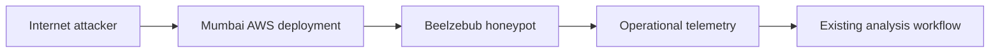
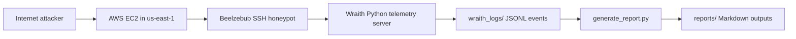

# System Architecture Notes

## Deployment Model

Ghost Cloud now documents two coexisting deployments:

- Mumbai deployment: the LLM-adapted AWS honeypot setup that used local Ollama `qwen2.5:0.5b` on `t3.micro` (Beelzebub on `2222` in `ap-south-1`) for dynamic shell responses - recovered period `2026-07-03` - `2026-07-26`, see `experiments/mumbai/`
- Wraith deployment: the newer `us-east-1`/Virginia deployment that uses a deterministic static shell and telemetry-focused SSH layer

## Mumbai Deployment

The Mumbai deployment is the LLM adaptation path described in `experiments/mumbai/`. It used local Ollama `qwen2.5:0.5b` on `t3.micro` and should be treated as the interactive, model-backed deployment rather than a plain baseline shell; the recovered dataset shows heavy scanning with minimal post-auth engagement and an operational OOM/networking limit on July 26.

## Wraith Deployment

The Wraith deployment adds a Beelzebub SSH honeypot and a custom telemetry server on the EC2 host. The SSH service remains the attacker-facing interface, while the static shell layer and telemetry server record structured JSONL events for later reporting.

## Cross-Deployment Comparison

| Aspect | Mumbai Deployment | Wraith Deployment |
|--------|-------------------|-------------------|
| Purpose | LLM-adapted interactive deployment | Additive research deployment with structured telemetry |
| Honeypot layer | Beelzebub with local Ollama `qwen2.5:0.5b` responses (Mumbai `t3.micro`) | Beelzebub SSH honeypot |
| Telemetry | Beelzebub logs → `scripts/generate_report.py` → `experiments/mumbai/*.md` | JSONL session and command telemetry |
| Output format | Recovered Markdown reports (24 dated + cumulative) | Markdown experiment reports generated from JSONL |
| Runtime model | Local Ollama `qwen2.5:0.5b` (high latency, OOM on `t3.micro`) | Deterministic static shell and Python telemetry pipeline |

## Wraith Components

- AWS EC2 Ubuntu instance in us-east-1/Virginia
- Beelzebub SSH honeypot on the public attack surface
- Static shell simulator for command responses
- Wraith telemetry server for structured event capture
- JSONL storage for session events and command execution records
- Markdown report generation pipeline via generate_report.py
- systemd services for persistence: beelzebub.service and wraith.service

## Wraith Event Flow

1. An attacker connects to SSH on the EC2 instance.
2. Beelzebub accepts the session and the static shell responds deterministically.
3. The telemetry server records session metadata and command execution details.
4. JSONL files accumulate the raw evidence.
5. generate_report.py converts the JSONL telemetry into experiment reports.
6. Reports are stored under reports/ for later review.

## Design Goal

The design goal is to keep both deployments documented while making the Wraith path deterministic, easy to operate, and straightforward to analyze without changing the earlier Mumbai LLM-backed documentation.
