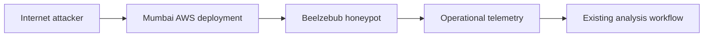
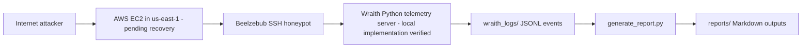

# System Architecture Notes

## Deployment Model

Ghost Cloud now documents two coexisting deployments:

- Mumbai deployment: the LLM-adapted AWS honeypot setup that used local Ollama `qwen2.5:0.5b` on `t3.micro` (Beelzebub on `2222` in `ap-south-1`) for dynamic shell responses - recovered period `2026-07-03` - `2026-07-26`, see `experiments/mumbai/`
- Wraith deployment: the newer `us-east-1`/Virginia deployment that uses a deterministic static shell and telemetry-focused SSH layer

## Mumbai Deployment

The Mumbai deployment is the LLM adaptation path described in `experiments/mumbai/`. It used local Ollama `qwen2.5:0.5b` on `t3.micro` and should be treated as the interactive, model-backed deployment rather than a plain baseline shell; the recovered dataset shows heavy scanning with minimal post-auth engagement and an operational OOM/networking limit on July 26.

## Wraith Deployment

The Wraith deterministic shell is implemented locally in `wraith/` (`filesystem.py`, `parser.py`, `session_identity.py`, `persona.py`, `privesc.py`, `registry.py`, `telemetry.py`, `server.py`) and is exercised via `demo_fake_shell.py` and `tests/test_fake_shell.py`. The intended cloud deployment is a Beelzebub SSH honeypot fronting the fake shell with a Python telemetry server on the EC2 host. The historical cloud instance `wraith-us-east-static` in `us-east-1` (historically `100.27.226.37`, port `2222`) is currently inaccessible and recovery is pending (port `22` refused, EC2 Instance Connect failed, SSM unavailable due to missing role configuration; serial console reaches a Linux login prompt). Until recovery completes, Wraith is documented as an implemented local simulator with an integration path in `deploy/`, not as a completed comparative dataset.

## Cross-Deployment Comparison

| Aspect | Mumbai Deployment | Wraith Deployment |
|--------|-------------------|-------------------|
| Purpose | LLM-adapted interactive deployment (observed) | Deterministic shell for controlled comparison (code implemented, cloud validation pending) |
| Honeypot layer | Beelzebub with local Ollama `qwen2.5:0.5b` responses (Mumbai `t3.micro`, observed) | Beelzebub SSH honeypot fronting fake shell (local implementation verified; cloud pending) |
| Telemetry | Beelzebub logs -> `scripts/generate_report.py` -> `experiments/mumbai/*.md` (recovered, validated) | JSONL session and command telemetry (`wraith/server.py` -> `wraith_logs/`) - local tests pass, no US-East telemetry incorporated yet |
| Output format | Recovered Markdown reports (24 dated + cumulative, period `2026-07-03T18:59:13Z` - `2026-07-26T17:23:56Z`) | Markdown experiment reports generated from JSONL - pending US-East data |
| Runtime model | Local Ollama `qwen2.5:0.5b` (high latency, OOM on `t3.micro` - observed) | Deterministic static shell and Python telemetry pipeline (no LLM fallback in production; LLM fallback is planned architecture) |
| Status | Completed and documented in `experiments/mumbai/` | Implemented locally; comparative analysis remains pending until US-East recovery |

## Wraith Components (verified in repository)

- Fake shell server and session (`wraith/server.py` - `FakeShellServer`, `FakeShellSession` with HTTP `/command` endpoint)
- Session identity and per-session state (`wraith/session_identity.py`, `wraith/randomizer.py` - isolated filesystem and history, seed-based persona variation)
- Command parsing (`wraith/parser.py` - shlex-based)
- Fake filesystem (`wraith/filesystem.py` - `PurePosixPath`, per-session CRUD, `mkdir`/`touch`/`ls`/`cat`/`cp`/`mv` etc.)
- Fake users and environment (`wraith/session_identity.py` - `admin`/`root` mode, `HOSTNAME`/`HOME`/`PATH` etc.)
- Deterministic command behavior (`wraith/server.py:88` - 30+ commands: `pwd`, `whoami`, `hostname`, `uname`, `ls`, `cat`, `wget`/`curl` simulated download, `sudo`/`su` simulation)
- Networking behavior (`wraith/network_backend.py` - simulated fetch, never executes real network calls)
- Fake process and system information (`wraith/server.py` - `ps`, `top`, `lscpu`, `free`, `df`, `systemctl` etc.)
- Telemetry (`wraith/telemetry.py` - `TelemetryLogger`, `events.jsonl` with `session_started`/`command_executed`/`session_ended`, append-only JSONL)
- Privilege escalation simulation (`wraith/privesc.py` and `server.py:237` - `sudo`/`su` flow with `root@db-prod-01`)
- Randomized and persona state (`wraith/randomizer.py`, `wraith/persona.py` - `db-prod-01` persona)
- Integration and server layer (`wraith/integration.py`, `deploy/beelzebub-simulator.patch`, `deploy/beelzebub_command_plugin.go`)
- Command registry (`wraith/registry.py` - download and reverse-shell payload tracking)

Planned but not production-complete: cross-session persistence via Redis (no Redis code present; filesystem is per-session in-memory only) and adaptive LLM fallback (architecture intends deterministic semantics first with optional controlled LLM assistance; no Ollama/OpenAI integration in `wraith/server.py`).

- JSONL storage for session events and command execution records (`wraith_logs/`)
- Markdown report generation pipeline via `scripts/generate_report.py` (supports Mumbai Beelzebub logs and Wraith JSONL)
- Systemd persistence definitions (`deploy/beelzebub-simulator.service`) - deployment pending US-East recovery

## Wraith Event Flow (intended, local verification)

1. An attacker connects to SSH on the EC2 instance (simulated locally via `FakeShellServer.create_session` or HTTP `/command`).
2. Beelzebub accepts the session and the fake shell responds deterministically (verified in `tests/test_fake_shell.py`).
3. The telemetry server records session metadata and command execution details (`wraith/telemetry.py`).
4. JSONL files accumulate the raw evidence (`wraith_logs/events.jsonl`).
5. `scripts/generate_report.py` converts the JSONL or Beelzebub logs into experiment reports.
6. Reports are stored under `reports/` for later review (Wraith) or `experiments/mumbai/` for Mumbai.

## Design Goal

The design goal is to keep both deployments documented while making the Wraith path deterministic, easy to operate, and straightforward to analyze without changing the earlier Mumbai LLM-backed documentation. Mumbai findings (high latency, inconsistent LLM shell semantics, rate limiting, OOM on `t3.micro`) directly motivate the hybrid direction: deterministic shell semantics first, with LLM as optional controlled extension.
