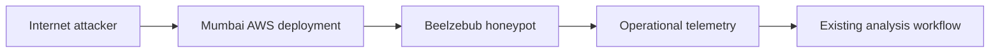
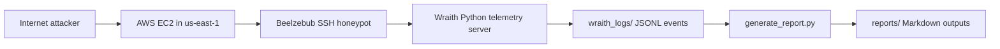

# System Architecture Notes

## Deployment Model

Ghost Cloud now documents two coexisting deployments:

- Mumbai deployment: the original AWS honeypot setup that remains preserved as a valid reference deployment
- Wraith deployment: the newer us-east-1 deployment that adds a deterministic telemetry-focused SSH layer

## Mumbai Deployment

The Mumbai deployment remains the original architecture described in the repository. It is preserved for historical continuity and comparison.

## Wraith Deployment

The Wraith deployment adds a Beelzebub SSH honeypot and a custom telemetry server on the EC2 host. The SSH service remains the attacker-facing interface, while the telemetry layer records structured JSONL events for later reporting.

## Cross-Deployment Comparison

| Aspect | Mumbai Deployment | Wraith Deployment |
|--------|-------------------|-------------------|
| Purpose | Original baseline deployment | Additive research deployment with structured telemetry |
| Honeypot layer | Existing documented Beelzebub setup | Beelzebub SSH honeypot |
| Telemetry | Existing operational logging | JSONL session and command telemetry |
| Output format | Existing reports and notes | Markdown experiment reports generated from JSONL |
| Runtime model | Preserved historical deployment | Deterministic Python telemetry pipeline |

## Wraith Components

- AWS EC2 Ubuntu instance in us-east-1
- Beelzebub SSH honeypot on the public attack surface
- Wraith telemetry server for structured event capture
- JSONL storage for session events and command execution records
- Markdown report generation pipeline via generate_report.py
- systemd services for persistence: beelzebub.service and wraith.service

## Wraith Event Flow

1. An attacker connects to SSH on the EC2 instance.
2. Beelzebub accepts the session and forwards command activity to the Wraith telemetry layer.
3. The telemetry server records session metadata and command execution details.
4. JSONL files accumulate the raw evidence.
5. generate_report.py converts the JSONL telemetry into experiment reports.
6. Reports are stored under reports/ for later review.

## Design Goal

The design goal is to keep both deployments documented while making the Wraith path deterministic, easy to operate, and straightforward to analyze without changing the earlier Mumbai documentation.
