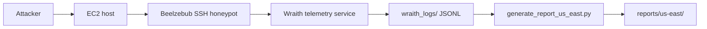

# AWS Deployment Notes

This repository documents two deployments. The Mumbai deployment remains the original reference deployment, and the Wraith deployment is the newer additive path in us-east-1.

## Shared AWS Infrastructure

- AWS EC2 Ubuntu server (Mumbai `t3.micro` verified; Wraith `us-east-1` historical)
- Mumbai region: `ap-south-1` (`wraith-honeypot`, Ubuntu 24.04)
- Wraith region: `us-east-1` (`wraith-us-east-static`, `100.27.226.37` - recovered via EBS repair, see `docs/us-east-recovery.md`)
- Instance role: public SSH honeypot host
- Public SSH exposure:
  - Port `22`: admin SSH access, restricted to operator IP (Mumbai verified `2026-07-03` - `2026-07-26`; Wraith `22` recovered - previously refused due to masked `ssh.socket`, now enabled)
  - Port `2222`: public SSH honeypot service (Mumbai verified `2026-07-03` - `2026-07-26`; Wraith verified `2026-07-12` - `2026-09-06` 12 sessions in `reports/us-east/`)
- Storage: EBS volume sized for logs, telemetry, and reports (Mumbai expanded 8 GB -> 15 GB for Ollama)

## Mumbai Deployment

The Mumbai deployment is preserved as the original documented AWS honeypot setup and remains valid. It is the LLM-adapted path, using local Ollama with `qwen2.5:0.5b` for interactive shell responses on `wraith-honeypot` (`t3.micro`, Ubuntu 24.04, `ap-south-1`, Beelzebub on `2222`). The recovered attacker-observation period is `2026-07-03T18:59:13Z` - `2026-07-26T17:23:56Z` (773 source IPs, 942 sessions, 15,153 login attempts, 1 command executed); see `experiments/mumbai/`.

See:
- [docs/architecture-notes.md](architecture-notes.md)
- [docs/telemetry-pipeline.md](telemetry-pipeline.md)

## Wraith Deployment (local implementation verified; cloud recovered with telemetry)

The Wraith deterministic shell is implemented locally in `wraith/` and verified via `demo_fake_shell.py` and `tests/test_fake_shell.py`. The cloud host `wraith-us-east-static` (`us-east-1`, `100.27.226.37`) was recovered after an admin SSH outage (masked `ssh.socket -> /dev/null`, `ssh.service` not enabled) via offline EBS repair with snapshot (see `docs/us-east-recovery.md`). It produced telemetry from `2026-07-12` to `2026-09-06` (12 IPs, 12 sessions, 21103 commands in `reports/us-east/`, see `docs/us-east-results.md`); Beelzebub and Wraith services were verified active after recovery and the observational comparison is in `docs/deployment-comparison.md`.

| Service | Port | Exposure | Purpose | Status |
|---------|------|----------|---------|--------|
| beelzebub.service | internal | local process | SSH honeypot orchestration | `deploy/beelzebub-simulator.service`, verified active after recovery |
| wraith.service | internal | local process | JSONL telemetry server (`wraith/server.py`) | Verified via `run_server.py` on `127.0.0.1:8080` and recovered `wraith_logs/events.jsonl` |
| SSH honeypot | 2222 | public internet | Attacker interaction | Mumbai `2026-07-03` - `2026-07-26` and Wraith `2026-07-12` - `2026-09-06` both verified |
| telemetry output | local JSONL | internal | Session and command logging | `wraith_logs/events.jsonl` via `wraith/telemetry.py`, append-only (`raw-data-us-east/` gitignored) |
| reports/ | filesystem path | local only | Markdown experiment reports | Mumbai `experiments/mumbai/` and Wraith `reports/us-east/` via `scripts/generate_report*.py` |

Do not assume other services are active unless they are explicitly enabled and verified. Both Mumbai and Wraith telemetry are now validated research artifacts; see `reports/us-east/cumulative.md` and `experiments/mumbai/cumulative.md`.

### Wraith runtime layout

### Wraith persistence

The Wraith deployment runs under systemd so it can remain active after disconnecting from the terminal (definitions in `deploy/`; verified active after `docs/us-east-recovery.md` EBS repair).

- `beelzebub.service` (`deploy/beelzebub-simulator.service`) keeps the SSH honeypot available - verified active post-recovery
- `wraith.service` keeps telemetry collection available (`wraith/server.py` HTTP server) - verified via recovered `wraith_logs/events.jsonl`

## Mumbai vs Wraith

| Aspect | Mumbai | Wraith |
|--------|--------|--------|
| Goal | LLM-adapted research deployment (observed) | Deterministic shell for controlled comparison (observed after recovery) |
| Telemetry | Beelzebub logs -> `scripts/generate_report.py` -> `experiments/mumbai/*.md` (recovered: 773 IPs, 942 sessions, 15153 logins, 1 command) | JSONL session and command events via `wraith/telemetry.py` -> `reports/us-east/` (recovered: 12 IPs, 12 sessions, 21103 commands) |
| Report generation | Regenerated Markdown reports (24 dated + cumulative) via `scripts/generate_report.py` | Markdown reports (14 daily + cumulative) via `scripts/generate_report_us_east.py` |
| Runtime model | Local Ollama `qwen2.5:0.5b` on `t3.micro` (operationally fragile under load; see `docs/mumbai-incident.md`) | Deterministic static SSH shell and telemetry pipeline (sub-millisecond, no LLM fallback in production) |
| Deployment status | Completed, investigated, documented in `docs/mumbai-results.md` | Recovered, investigated, documented in `docs/us-east-results.md` and `docs/us-east-recovery.md` |
| Comparative analysis | Baselines Mumbai | Observational comparison in `docs/deployment-comparison.md` (caveat: different regions/periods, not controlled causal experiment) |

## Deployment Workflow

### Mumbai

The Mumbai deployment is the historical LLM baseline and should continue to be documented as the Beelzebub + local Ollama `qwen2.5:0.5b` adaptation path (see `experiments/mumbai/README.md` for the July 26 OOM/networking interruption and September 10 recovery). Status: completed.

### Wraith

Workflow (local verification and cloud recovered):

1. Deploy Beelzebub and the Wraith telemetry service on the EC2 host (`wraith-us-east-static` recovered via EBS repair, see `docs/us-east-recovery.md`).
2. Enable the systemd services (`deploy/beelzebub-simulator.service` - verified `ssh.service` enabled, `ssh.socket` mask removed).
3. Confirm SSH access through port `2222` (`100.27.226.37:2222` verified `2026-07-12` - `2026-09-06`, 12 sessions).
4. Collect JSONL telemetry under `wraith_logs/` (`wraith/telemetry.py` `events.jsonl`, `raw-data-us-east/` gitignored).
5. Generate Markdown reports into `reports/us-east/` via `scripts/generate_report_us_east.py` (daily `--out-file` redirection, cumulative `--all`), see `docs/us-east-results.md`.

## Setup References

- [infra/aws-setup.md](../infra/aws-setup.md)
- [infra/ec2-configuration.md](../infra/ec2-configuration.md)
- [infra/security-groups.md](../infra/security-groups.md)
- [docs/telemetry-pipeline.md](telemetry-pipeline.md)
