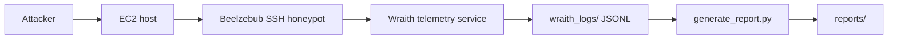

# AWS Deployment Notes

This repository documents two deployments. The Mumbai deployment remains the original reference deployment, and the Wraith deployment is the newer additive path in us-east-1.

## Shared AWS Infrastructure

- AWS EC2 Ubuntu server
- Region: `us-east-1` for the Wraith deployment
- Instance role: public SSH honeypot host
- Public SSH exposure:
  - Port `22`: admin SSH access, restricted by security group
  - Port `2222`: public SSH honeypot service
- Storage: EBS volume sized for logs, telemetry, and reports

## Mumbai Deployment

The Mumbai deployment is preserved as the original documented AWS honeypot setup and remains valid.

See:
- [docs/architecture-notes.md](architecture-notes.md)
- [docs/llm-backend-notes.md](llm-backend-notes.md)

## Wraith Deployment

The Wraith deployment adds a deterministic telemetry pipeline alongside the existing project history.

| Service | Port | Exposure | Purpose |
|---------|------|----------|---------|
| beelzebub.service | internal | local process | SSH honeypot orchestration |
| wraith.service | internal | local process | JSONL telemetry server |
| SSH honeypot | 2222 | public internet | Attacker interaction |
| telemetry output | local JSONL | internal | Session and command logging |
| reports/ | filesystem path | local only | Markdown experiment reports |

Do not assume other services are active unless they are explicitly enabled and verified.

### Wraith runtime layout

### Wraith persistence

The Wraith deployment is intended to run under systemd so it can remain active after disconnecting from the terminal.

- `beelzebub.service` keeps the SSH honeypot available
- `wraith.service` keeps telemetry collection available

## Mumbai vs Wraith

| Aspect | Mumbai | Wraith |
|--------|--------|--------|
| Goal | Original research deployment | Additive structured-telemetry deployment |
| Telemetry | Existing operational notes | JSONL session and command events |
| Report generation | Existing experiment summaries | generate_report.py Markdown reports |
| Runtime model | Preserved original stack | Deterministic SSH telemetry pipeline |

## Deployment Workflow

### Mumbai

The Mumbai deployment remains the historical baseline and should continue to be documented as originally intended.

### Wraith

1. Deploy Beelzebub and the Wraith telemetry service on the EC2 host.
2. Enable the systemd services.
3. Confirm SSH access through port `2222`.
4. Collect JSONL telemetry under `wraith_logs/`.
5. Generate Markdown reports into `reports/`.

## Setup References

- [infra/aws-setup.md](../infra/aws-setup.md)
- [infra/ec2-configuration.md](../infra/ec2-configuration.md)
- [infra/security-groups.md](../infra/security-groups.md)
- [docs/telemetry-pipeline.md](telemetry-pipeline.md)
