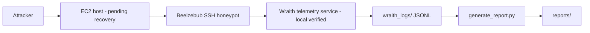

# AWS Deployment Notes

This repository documents two deployments. The Mumbai deployment remains the original reference deployment, and the Wraith deployment is the newer additive path in us-east-1.

## Shared AWS Infrastructure

- AWS EC2 Ubuntu server (Mumbai `t3.micro` verified; Wraith `us-east-1` historical)
- Mumbai region: `ap-south-1` (`wraith-honeypot`, Ubuntu 24.04)
- Wraith historical region: `us-east-1` (`wraith-us-east-static`, `100.27.226.37` - recovery pending)
- Instance role: public SSH honeypot host
- Public SSH exposure:
  - Port `22`: admin SSH access, restricted to operator IP (Mumbai verified; Wraith `22` currently refused)
  - Port `2222`: public SSH honeypot service (Mumbai verified `2026-07-03` - `2026-07-26`; Wraith `2222` historically accepted connections)
- Storage: EBS volume sized for logs, telemetry, and reports (Mumbai expanded 8 GB -> 15 GB for Ollama)

## Mumbai Deployment

The Mumbai deployment is preserved as the original documented AWS honeypot setup and remains valid. It is the LLM-adapted path, using local Ollama with `qwen2.5:0.5b` for interactive shell responses on `wraith-honeypot` (`t3.micro`, Ubuntu 24.04, `ap-south-1`, Beelzebub on `2222`). The recovered attacker-observation period is `2026-07-03T18:59:13Z` - `2026-07-26T17:23:56Z` (773 source IPs, 942 sessions, 15,153 login attempts, 1 command executed); see `experiments/mumbai/`.

See:
- [docs/architecture-notes.md](architecture-notes.md)
- [docs/llm-backend-notes.md](llm-backend-notes.md)

## Wraith Deployment (local implementation verified; cloud recovery pending)

The Wraith deterministic shell is implemented locally in `wraith/` and verified via `demo_fake_shell.py` and `tests/test_fake_shell.py`. The historical cloud host `wraith-us-east-static` (`us-east-1`, `100.27.226.37`) previously accepted connections on `2222` into a fake shell, but is currently inaccessible: admin `22` returns connection refused, EC2 Instance Connect fails, SSM is unavailable due to missing instance-management role configuration, serial console reaches a Linux login prompt. Recovery is in progress and no Wraith cloud telemetry has been incorporated into comparative analysis yet.

| Service | Port | Exposure | Purpose | Status |
|---------|------|----------|---------|--------|
| beelzebub.service | internal | local process | SSH honeypot orchestration | Defined in `deploy/beelzebub-simulator.service`, deployment pending recovery |
| wraith.service | internal | local process | JSONL telemetry server (`wraith/server.py`) | Local verification via `run_server.py` on `127.0.0.1:8080` |
| SSH honeypot | 2222 | public internet | Attacker interaction | Mumbai verified; Wraith historical `100.27.226.37:2222` previously accepted, now pending |
| telemetry output | local JSONL | internal | Session and command logging | `wraith_logs/events.jsonl` via `wraith/telemetry.py`, append-only |
| reports/ | filesystem path | local only | Markdown experiment reports | Generated via `scripts/generate_report.py` |

Do not assume other services are active unless they are explicitly enabled and verified. Currently only Mumbai telemetry is validated as a research artifact; Wraith cloud telemetry is not yet available.

### Wraith runtime layout (intended)

### Wraith persistence

The Wraith deployment is intended to run under systemd so it can remain active after disconnecting from the terminal (definitions in `deploy/`). Cloud systemd enablement is pending US-East recovery.

- `beelzebub.service` (`deploy/beelzebub-simulator.service`) keeps the SSH honeypot available
- `wraith.service` keeps telemetry collection available (local `wraith/server.py` HTTP server)

## Mumbai vs Wraith

| Aspect | Mumbai | Wraith |
|--------|--------|--------|
| Goal | LLM-adapted research deployment (observed) | Deterministic shell for controlled comparison (code implemented, cloud pending) |
| Telemetry | Beelzebub logs -> `scripts/generate_report.py` -> `experiments/mumbai/*.md` (recovered) | JSONL session and command events via `wraith/telemetry.py` (local verification, no cloud data yet) |
| Report generation | Regenerated Markdown reports (24 dated + cumulative) | `scripts/generate_report.py` Markdown reports (pending US-East data) |
| Runtime model | Local Ollama `qwen2.5:0.5b` on `t3.micro` (operationally fragile under load; see `experiments/mumbai/`) | Deterministic static SSH shell and telemetry pipeline (no LLM fallback in production) |
| Deployment status | Completed, investigated, documented | Local code complete; `wraith-us-east-static` recovery pending, no comparative results yet |
| Comparative analysis | Baselines Mumbai | Intended static-vs-interactive comparison remains pending until US-East recovery |

## Deployment Workflow

### Mumbai

The Mumbai deployment is the historical LLM baseline and should continue to be documented as the Beelzebub + local Ollama `qwen2.5:0.5b` adaptation path (see `experiments/mumbai/README.md` for the July 26 OOM/networking interruption and September 10 recovery). Status: completed.

### Wraith

Intended workflow (local verification done, cloud deployment pending recovery):

1. Deploy Beelzebub and the Wraith telemetry service on the EC2 host (`wraith-us-east-static` recovery pending).
2. Enable the systemd services (`deploy/beelzebub-simulator.service`).
3. Confirm SSH access through port `2222` (historically `100.27.226.37:2222` accepted; currently not validated).
4. Collect JSONL telemetry under `wraith_logs/` (`wraith/telemetry.py`).
5. Generate Markdown reports into `reports/` via `scripts/generate_report.py` after validation.

## Setup References

- [infra/aws-setup.md](../infra/aws-setup.md)
- [infra/ec2-configuration.md](../infra/ec2-configuration.md)
- [infra/security-groups.md](../infra/security-groups.md)
- [docs/telemetry-pipeline.md](telemetry-pipeline.md)
