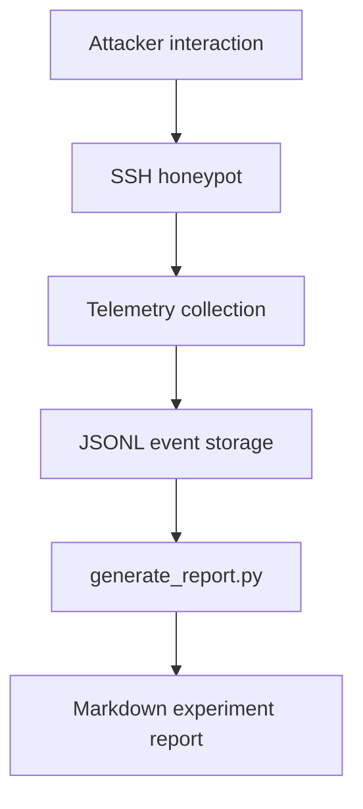

# Telemetry Pipeline Notes

## Overview

This document describes the Wraith telemetry pipeline used by the newer deployment in us-east-1. The original Mumbai deployment remains documented elsewhere and is not replaced by this pipeline.

## Wraith Telemetry Flow

## Event Types

### session_started

Emitted when a new SSH session is created.

Typical fields:

- `event`
- `session_id`
- `attacker_ip`
- `client`
- `timestamp`

### command_executed

Emitted for each simulated command execution.

Typical fields:

- `event`
- `session_id`
- `attacker_ip`
- `client`
- `command`
- `response`
- `cwd`
- `latency_ms`
- `timestamp`

### session_ended

Emitted when the session ends.

Typical fields:

- `event`
- `session_id`
- `attacker_ip`
- `client`
- `duration_seconds`
- `commands`
- `timestamp`

## JSONL Storage

Wraith stores one JSON object per line. Malformed lines are ignored by the report generator so telemetry can continue to be consumed even if a log line is incomplete.

Suggested storage layout:

- `wraith_logs/` for raw JSONL telemetry
- `reports/` for generated Markdown reports

## Report Generation

`generate_report.py` reads JSONL telemetry and produces experiment summaries that can include:

- date
- total sessions
- unique attacker IPs
- clients used
- commands executed
- command frequency
- session duration
- suspicious commands

## Collected Fields

Wraith telemetry focuses on the fields that matter for attacker-behavior analysis:

- attacker IP
- client
- command
- response
- cwd
- latency_ms
- timestamps

## Backward Compatibility

The telemetry format is intentionally simple so older reports can still coexist with newer Wraith logs while the repository keeps the Mumbai deployment documentation intact.
