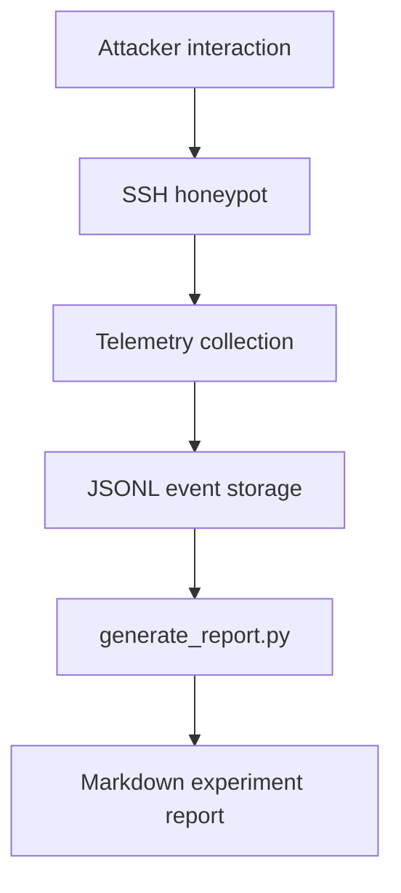

# Wraith Telemetry Pipeline Notes

## Overview

This document describes the Wraith deterministic shell telemetry pipeline (`wraith/` on `127.0.0.1:8080` or `8765`, `wraith_logs/`). The Mumbai deployment (`ap-south-1`, `t3.micro`, Beelzebub + local Ollama `qwen2.5:0.5b`, period `2026-07-03T18:59:13Z` - `2026-07-26T17:23:56Z`) remains documented in `experiments/mumbai/` and uses raw Beelzebub logs directly; it is not replaced by this pipeline. The Wraith cloud instance `wraith-us-east-static` (`us-east-1`, `100.27.226.37`) is pending recovery, so Wraith JSONL telemetry has not yet contributed to comparative analysis.

## Wraith Telemetry Flow

## Event Types

### session_started

Emitted when a new SSH session is created.

Typical fields:

- `event`
- `session_id`
- `attacker_ip`
- `client`
- `timestamp`

### command_executed

Emitted for each simulated command execution.

Typical fields:

- `event`
- `session_id`
- `attacker_ip`
- `client`
- `command`
- `response`
- `cwd`
- `latency_ms`
- `timestamp`

### session_ended

Emitted when the session ends.

Typical fields:

- `event`
- `session_id`
- `attacker_ip`
- `client`
- `duration_seconds`
- `commands`
- `timestamp`

## JSONL Storage

Wraith stores one JSON object per line. Malformed lines are ignored by the report generator so telemetry can continue to be consumed even if a log line is incomplete.

Suggested storage layout:

- `wraith_logs/` for raw JSONL telemetry
- `reports/` for generated Markdown reports

## Report Generation

`generate_report.py` reads JSONL telemetry and produces experiment summaries that can include:

- date
- total sessions
- unique attacker IPs
- clients used
- commands executed
- command frequency
- session duration
- suspicious commands

## Collected Fields

Wraith telemetry focuses on the fields that matter for attacker-behavior analysis:

- attacker IP
- client
- command
- response
- cwd
- latency_ms
- timestamps

## Deployment Status

- **Mumbai:** Completed, recovered, and documented (`experiments/mumbai/` - 24 dated reports + cumulative, 773 IPs, 942 sessions, 15,153 logins, 1 command). Investigation of July 26 OOM and degraded networking complete (see `experiments/mumbai/README.md`).
- **Wraith local:** Implemented and verified (`wraith/` modules, `demo_fake_shell.py`, `tests/test_fake_shell.py` pass). Telemetry is per-session in-memory (no Redis persistence; no LLM fallback in `wraith/server.py`).
- **Wraith cloud (`us-east-1`):** Historical instance `wraith-us-east-static` pending recovery; no telemetry incorporated yet. Static-vs-interactive comparison remains pending.

## Backward Compatibility

The telemetry format is intentionally simple so older reports can still coexist with newer Wraith logs while the repository keeps the Mumbai deployment documentation intact. `scripts/generate_report.py` handles both Beelzebub logs (Mumbai) and Wraith JSONL, with `--out-file` applying generally and zero-activity wording `No attacker login attempts or command execution were recorded for this period.` for validation intervals like `2026-07-01.md`.
