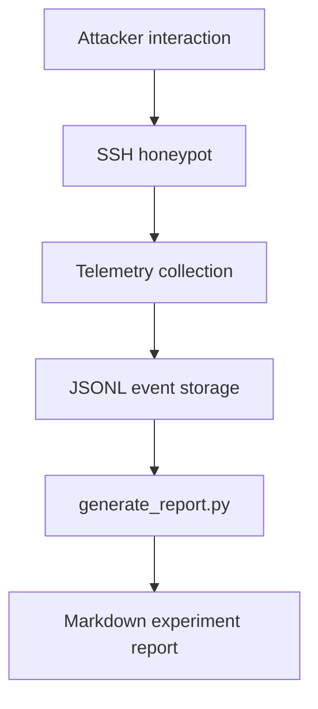

# Wraith Telemetry Pipeline

## Purpose

This document explains how the Wraith deployment records SSH attacker activity and turns it into Markdown reports.

## Flow

## Event Types

### session_started

Created when a new session begins.

Fields:

- `event`
- `session_id`
- `attacker_ip`
- `client`
- `timestamp`

### command_executed

Created for each simulated command.

Fields:

- `event`
- `session_id`
- `attacker_ip`
- `client`
- `command`
- `response`
- `cwd`
- `latency_ms`
- `timestamp`

### session_ended

Created when the SSH session finishes.

Fields:

- `event`
- `session_id`
- `attacker_ip`
- `client`
- `duration_seconds`
- `commands`
- `timestamp`

## Storage Locations

- `wraith_logs/` contains raw JSONL telemetry
- `reports/` contains generated Markdown output

## Report Output

`generate_report.py` is used to transform the JSONL telemetry into experiment reports that summarize:

- total sessions
- unique attacker IPs
- SSH client strings
- command counts and frequency
- suspicious command patterns
- session duration statistics

## Operational Notes

- Each line in the JSONL file should be a single JSON object.
- Malformed lines are ignored safely during parsing.
- Telemetry is designed to be append-only so the report pipeline can be rerun later.