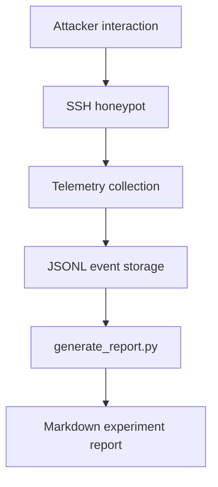

# Wraith Telemetry Pipeline

## Purpose

This document explains how the Wraith deterministic shell records SSH attacker activity and turns it into Markdown reports. It applies to the Wraith local implementation (`wraith/` -> `wraith_logs/` -> `reports/`). The Mumbai deployment (`ap-south-1`, Beelzebub + local Ollama `qwen2.5:0.5b`) uses raw Beelzebub logs directly via `scripts/generate_report.py` -> `experiments/mumbai/` and is documented separately. Wraith cloud telemetry from `wraith-us-east-static` (`us-east-1`) is pending recovery and has not yet been incorporated.

## Flow

## Event Types

### session_started

Created when a new session begins.

Fields:

- `event`
- `session_id`
- `attacker_ip`
- `client`
- `timestamp`

### command_executed

Created for each simulated command.

Fields:

- `event`
- `session_id`
- `attacker_ip`
- `client`
- `command`
- `response`
- `cwd`
- `latency_ms`
- `timestamp`

### session_ended

Created when the SSH session finishes.

Fields:

- `event`
- `session_id`
- `attacker_ip`
- `client`
- `duration_seconds`
- `commands`
- `timestamp`

## Storage Locations

- `wraith_logs/` contains raw JSONL telemetry
- `reports/` contains generated Markdown output

## Report Output

`scripts/generate_report.py` is used to transform the JSONL telemetry (Wraith) or Beelzebub logs (Mumbai) into experiment reports that summarize:

- total sessions
- unique observed source IPs
- SSH client strings
- command counts and frequency (Mumbai: 1 command total; Wraith pending)
- suspicious command patterns
- session duration statistics

Verification: `wraith/telemetry.py` appends `events.jsonl` and is exercised by `tests/test_fake_shell.py` and `demo_fake_shell.py`; Mumbai logs were validated via regeneration of 24 dated reports.

## Operational Notes

- Each line in the JSONL file should be a single JSON object; Mumbai Beelzebub logs are JSONL with `event` envelope.
- Malformed lines are ignored safely during parsing.
- Telemetry is designed to be append-only so the report pipeline can be rerun later (`--out-file` and `--no-geo` supported).
- Wraith cloud reports in `reports/` remain pending until US-East recovery; only `experiments/mumbai/` is validated as a research artifact.